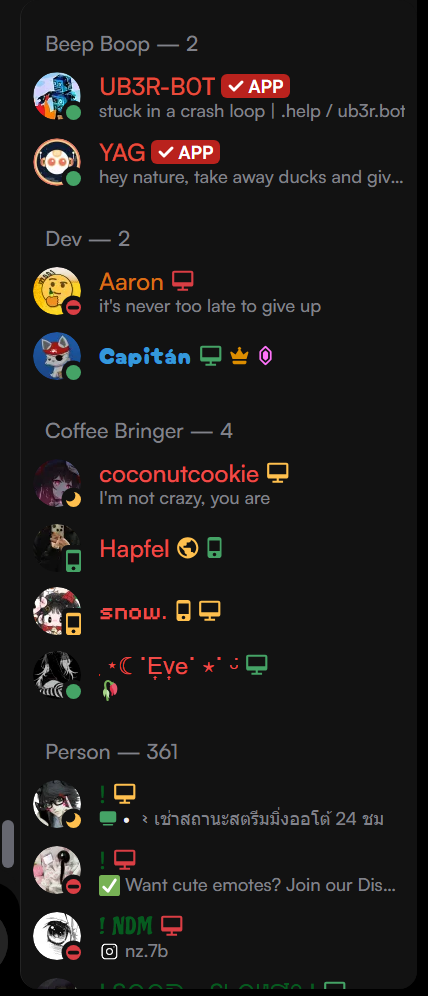
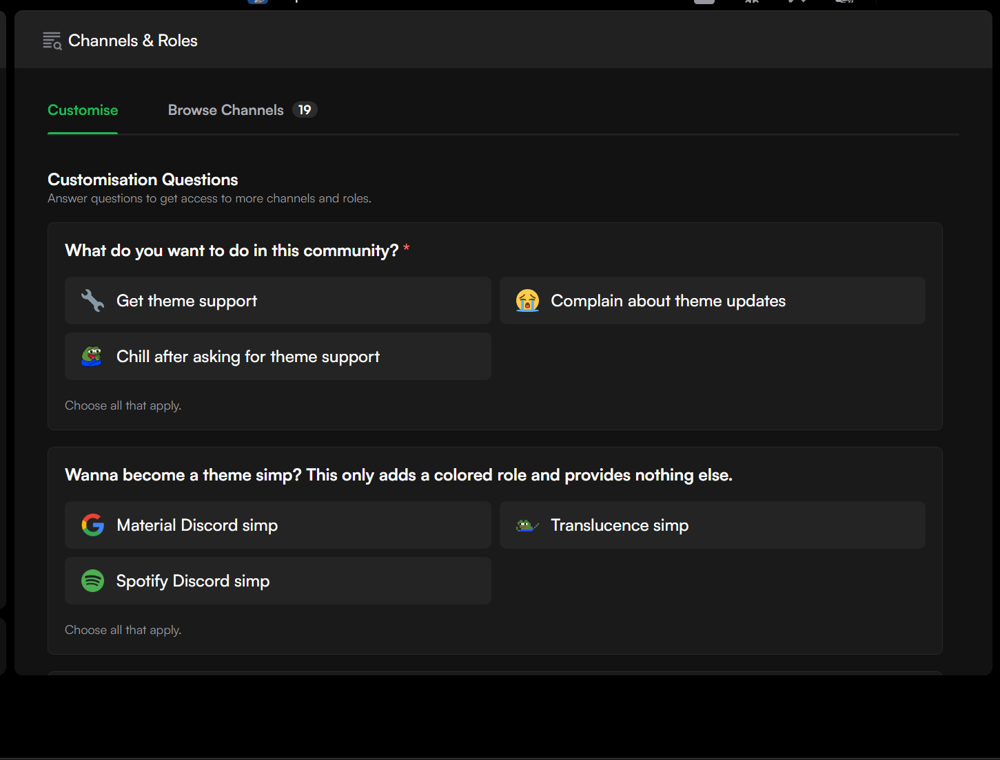
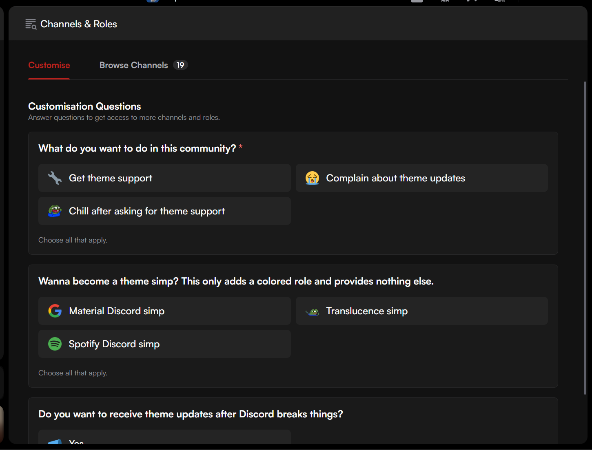
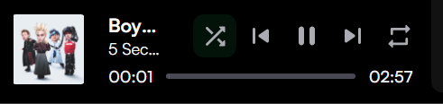
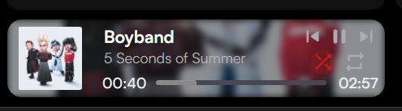
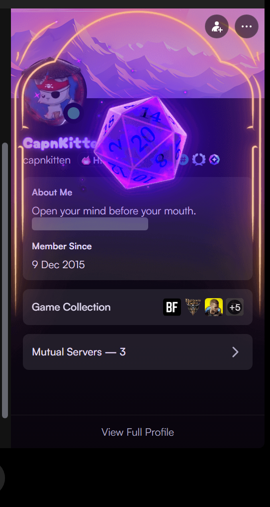
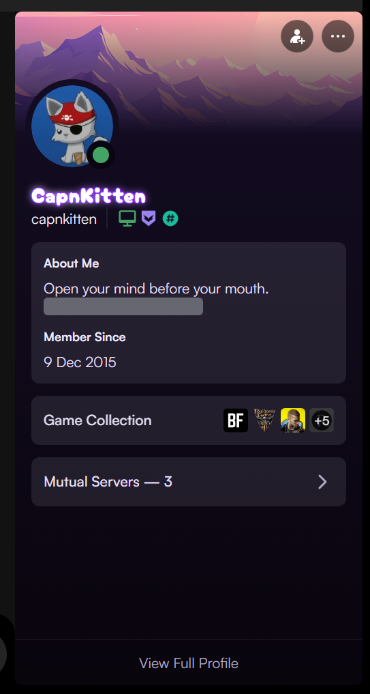
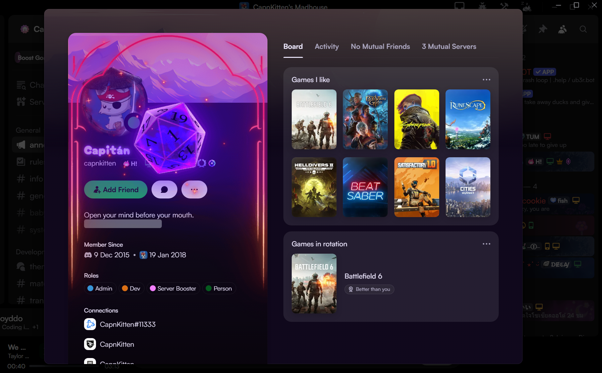
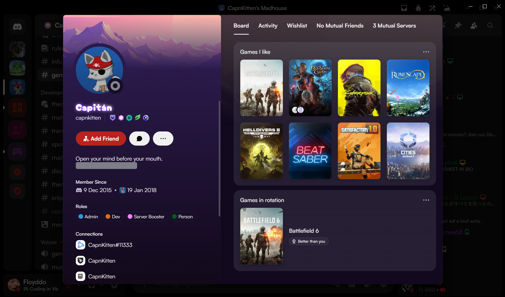

# Spotify discord theme modifications
These are some modifications and additions of CapnKitten's [original spotify discord theme](https://github.com/CapnKitten/Spotify-Discord). All credits go to him!

# Installation
Install this by putting the `Spotify-Discord.theme.min.css` in your theme folder. Alternatively, use this online link to put in your online themes: `https://raw.githubusercontent.com/Floyddo/vencordthemes/refs/heads/main/Spotify-Discord.theme.min.css`

# Changes

## Visual Comparisons

|Change | Before | After |
|--------|--------|-------|
| **Sidebar content**: Makes all sidebars use up their full height |  |  |
| **Full screen content without a textarea**: make all content take up their full height |  |  |
| **Spotify Now Playing**: Moves the controls to make them only visible on hover, makes them smaller and adds a blurred backdrop of the song |  |  |
| **Profile Modal Styling**: Enhanced profile layout|  |  |
| **Full Profile Display**: Improved full screen profile styling |  |  |

## Features

> [!NOTE]  
> Some of these features are unwanted. Feel free to comment them out when using them.

- **Decommercialize**: Removed Nitro badges, premium profile decorations, quest badges, store/shop links, clan tags, and other unwanted features
- **Guild Folder Icons**: Replaced generic folder icons with custom Material Design icons (customizable by folder color)
  - *You should make your own. Instructions are in the file.*
  - Apps folder → Dashboard icon
  - My servers folder → Engineering icon
  - Roblox folder → Gaming icon
- **Chat Enhancements**: Improved chat styling with inverted border effects
- **Profile Styling**: Enhanced profile modal layout with mask gradients on banners
- **Spotify Controls**: Customized Spotify player controls with accent color styling and album art background blur
- **Destructive Actions**: Added red colors to destructive actions where they weren't already applied
- **Search Bar**: Input styled as button instead of default styling
- **Bug Fixes**: Small bugfixes and improvements

